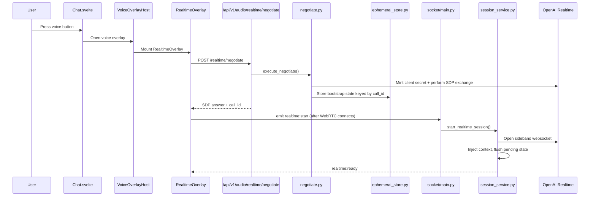
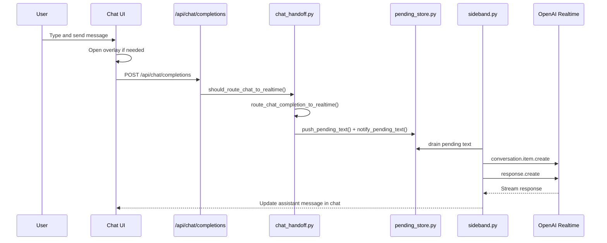
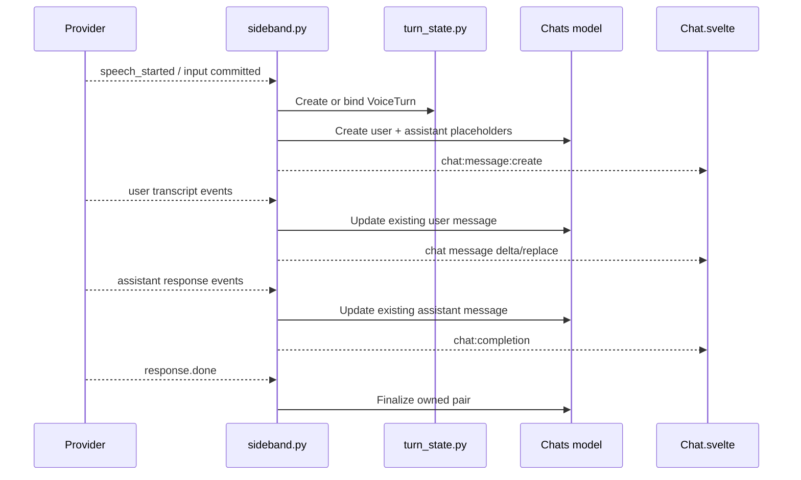
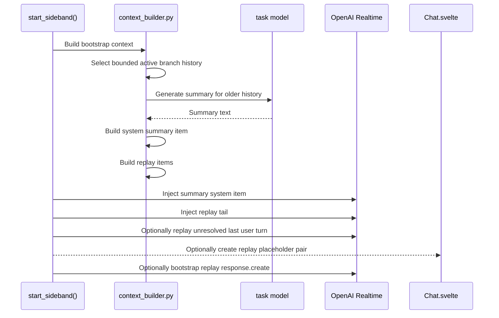
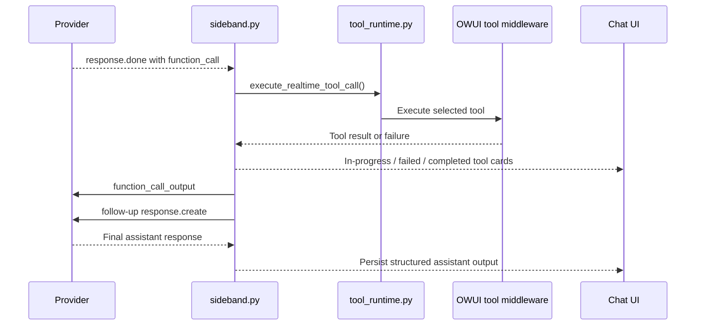
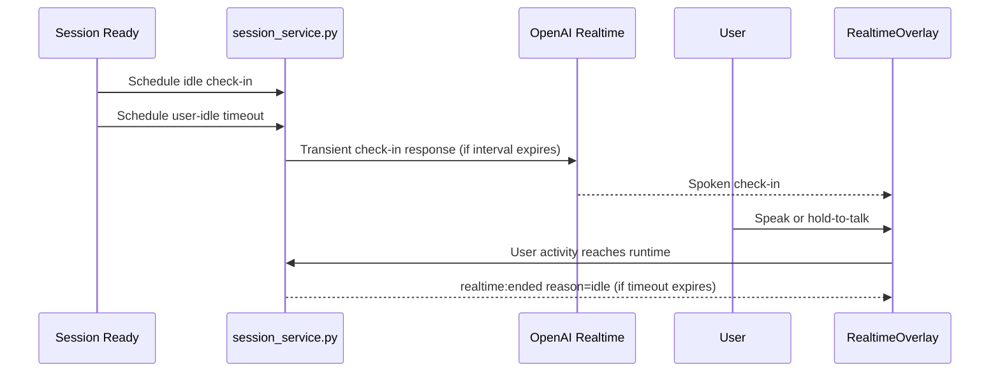

# Realtime Voice Architecture

This page describes how Open WebUI integrates OpenAI Realtime voice conversations into the normal chat product surface.

## Backend Module Map

The realtime subsystem lives primarily under `backend/open_webui/realtime/`.

Main modules:

- `session_service.py`
  - core realtime session orchestration
  - session preparation, bootstrap, ownership, and lifecycle entrypoints
  - readiness, stop, reconnect, and idle orchestration
- `context_builder.py`
  - bounded history extraction
  - summary generation input
  - replay tail construction
  - unanswered last-user-turn handling
- `sideband.py`
  - sideband websocket runtime
  - provider event handling
  - context injection and pending-text drain
  - response / tool execution loop
- `chat_sync.py`
  - voice-turn placeholder creation
  - transcript/message persistence
  - owned-pair finalization and cleanup
- `catalog.py`
  - realtime-capable model detection
  - model/voice capability enrichment
- `client_config.py`
  - verified-user realtime defaults and capabilities for the frontend
- `chat_handoff.py`
  - typed request handoff from normal chat entrypoints into realtime
- `tool_runtime.py`
  - realtime-specific tool runtime bridge into OWUI tool middleware
- `turn_state.py`
  - provider-event ownership and in-memory turn identity
- `app_hooks.py`
  - realtime background startup tasks

Related integration points:

- `backend/open_webui/main.py`
  - normal `/api/chat/completions` gateway and typed handoff decision point
- `backend/open_webui/routers/audio.py`
  - realtime negotiate endpoint
  - verified-user client config endpoint
  - admin audio config endpoint
- `backend/open_webui/socket/main.py`
  - imports and registers the realtime socket handlers
- `backend/open_webui/realtime/socket_handlers.py`
  - `realtime:start`
  - `realtime:stop`
  - `realtime:cancel`
  - audio commit/clear, runtime updates, and response-state events

## Frontend Ownership

Realtime Voice uses a layered frontend ownership model.

- `Chat.svelte`
  - owns chat history state
  - owns typed submit/edit/regenerate entrypoints
  - owns when the overlay should open
  - applies realtime chat events into the message tree
- `VoiceOverlayHost.svelte`
  - owns overlay hosting and layout
  - chooses which voice overlay to mount
- `RealtimeOverlay.svelte`
  - owns the live realtime call runtime
  - manages WebRTC, socket listeners, mic/PTT state, reconnect state, and live feedback

This split keeps the overlay runtime independent from the controls panel and keeps chat history ownership in the chat layer.

## Ownership Boundaries

### Chat owns when the overlay opens

The chat runtime decides when realtime starts:

- voice button press
- typed send on a realtime-capable model
- edited user-message send on a realtime-capable model

### The overlay host owns which overlay mounts

`VoiceOverlayHost` chooses between the legacy call overlay and the realtime overlay, but does not own chat history.

### The realtime overlay owns the live call runtime

`RealtimeOverlay` owns:

- peer connection state
- runtime status text
- mute/PTT behavior
- speaking/tool/listening cues
- response-scoped interrupt UI
- reconnect and terminal error state

Internally, the overlay also listens to response lifecycle events so interruption can be tied to the active provider response instead of raw click count.

## Fresh Voice Call Bootstrap

## Typed Message to Realtime

Typed realtime is not a separate product surface. It still enters through the normal chat completion gateway, but realtime handoff happens before the standard non-realtime completion handler runs.

## Spoken Turn Lifecycle

Realtime turns use a strict owned-pair model:

- one user message
- one assistant message

Later provider events must update those same nodes instead of creating siblings.

## Context Bootstrap Model

Realtime continuity is built from the current chat branch in three parts:

1. **System prompt**
   - the merged OWUI system prompt stays in `session.instructions`
2. **Older history**
   - optionally summarized into a system context block
3. **Recent history**
   - replayed as actual conversation items

The unresolved trailing user turn is handled separately according to policy:

- `discard`
- `replay`

### Summary and Replay Flow

## Tool Execution Flow

Realtime reuses OWUI’s tool-selection and rendering contracts, but the runtime orchestration is realtime-owned.

## Turn Ownership and `advance_current=False`

Realtime updates frequently patch existing messages after those nodes already exist in the chat tree:

- transcript finalization
- assistant output persistence
- replay placeholder reuse
- stop/end cleanup

For those updates, OWUI uses `advance_current=False` when patching existing nodes. This prevents realtime provider events from rewinding the active chat head and creating incorrect branches during interruption or replay-heavy flows.

The result is:

- linear voice turn ownership
- fewer duplicate branches
- correct head state during in-flight assistant responses

## Idle Lifecycle

Realtime uses two separate idle behaviors:

- **idle check-in**
  - transient spoken prompt to re-engage a silent user
  - not persisted as a normal chat turn
- **session idle timeout**
  - ends the call after prolonged user inactivity

## Stop, End, and Reconnect

Session end can come from:

- explicit user stop
- reconnect flow
- idle timeout
- provider/runtime error

Each live call is correlated by the provider `call_id` and surfaced to the frontend as `callId` on realtime lifecycle events. The overlay ignores stale end, ready, and reconnect events whose `callId` no longer matches the current live call.

Placeholder-only turns can be pruned during shutdown. Real transcript or assistant content is preserved and finalized.

The overlay and chat tree are intentionally kept separate:

- the overlay owns the live runtime
- the chat tree owns persisted history

That separation is what makes typed handoff, interruption, reconnect, and cleanup predictable inside a normal OWUI chat.
