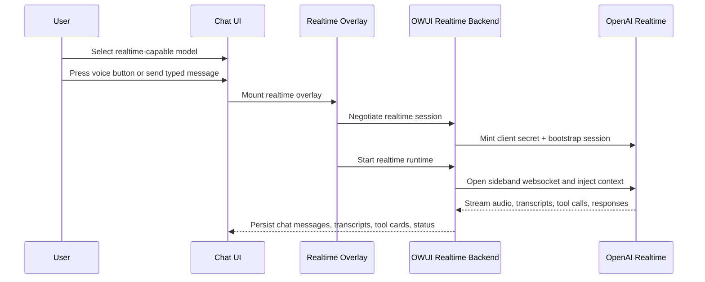

:::warning Experimental Feature
Realtime Voice is currently an experimental chat mode built around OpenAI Realtime and WebRTC. Provider capabilities, supported voices, and some runtime behavior depend on the configured realtime models.
:::

# Realtime Voice

**Realtime Voice** adds a live voice conversation mode to Open WebUI for realtime-capable models. It combines:

- live WebRTC voice calls
- typed message handoff into the same realtime session
- streamed assistant speech and transcripts
- inline tool execution and tool cards
- continuity from recent chat history

Unlike the older call path, Realtime Voice uses a persistent provider session and keeps the conversation inside the normal chat tree instead of creating a separate interaction surface.

## Entry Points

You can start a realtime session in two ways:

- press the normal voice button on a realtime-capable model
- type and send a message on a realtime-capable model

Typed send is not treated as a separate “text-only” path for realtime models. Open WebUI can open the realtime overlay, start the realtime session, and route the turn through the live realtime runtime.

## How Realtime Voice Differs from Standard Chat

- The model can listen and respond in near real time instead of waiting for a full request/response cycle.
- The overlay owns a live call session with microphone state, reconnect handling, interruption, and push-to-talk support.
- Older chat history can be summarized and recent turns replayed into the provider session for continuity.
- Tool calls happen during the live session and persist as normal OWUI tool cards in chat history.
- Assistant completions inside a live voice session suppress the normal “new response” notification behavior used by standard chat.

## In This Section

- [Usage](./usage.mdx)
- [Admin Setup](./admin-setup.mdx)
- [Capabilities and Limitations](./capabilities-and-limitations.mdx)
- [Architecture](./architecture.mdx)

## High-Level Flow

## Capability-Driven Behavior

Realtime Voice uses backend-provided capability data for things like:

- which models are treated as realtime-capable
- which voices are offered
- which user-facing realtime settings are available

This avoids hard-coding a single static provider matrix into the frontend. For admin details, see [Admin Setup](./admin-setup.mdx). For implementation details, see [Architecture](./architecture.mdx).
